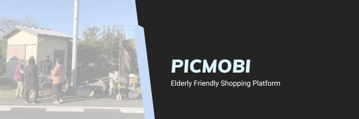

## About

- Our innovative service aims to support the shopping needs of elderly people with limited mobility and those who have lost their driver's licenses. 
- Users simply take a photo of the product they wish to purchase, and our mobility team delivers the item to a nearby hub. 
- Through this service, we strive to assist in shopping and foster a culture that values community.

## Getting Started

#### Step 1: Installing Flutter

Before running Flutter, you must have the Flutter SDK installed on your computer. If you don't have Flutter installed yet, you can download and install Flutter from [here](https://docs.flutter.dev/get-started/install).

#### Step 2: Installing Dependencies

To install the dependencies, run the following command in the root directory of the project:

```zsh
flutter pub get
```

#### Step 3: Running the App

To run the app, run the following command in the root directory of the project:

```zsh
flutter build web
```


## ラズパイの設定

```
python3 -m venv venv
source venv/bin/activate
pip3 install --upgrade pip
pip3 install --upgrade firebase-admin
pip3 install gpsd-py3

# ラズパイにsshで接続
ssh 

# ラズパイにscpでファイルを転送
scp -r firebase-sdk.json user@raspberrypi.local:~/
```